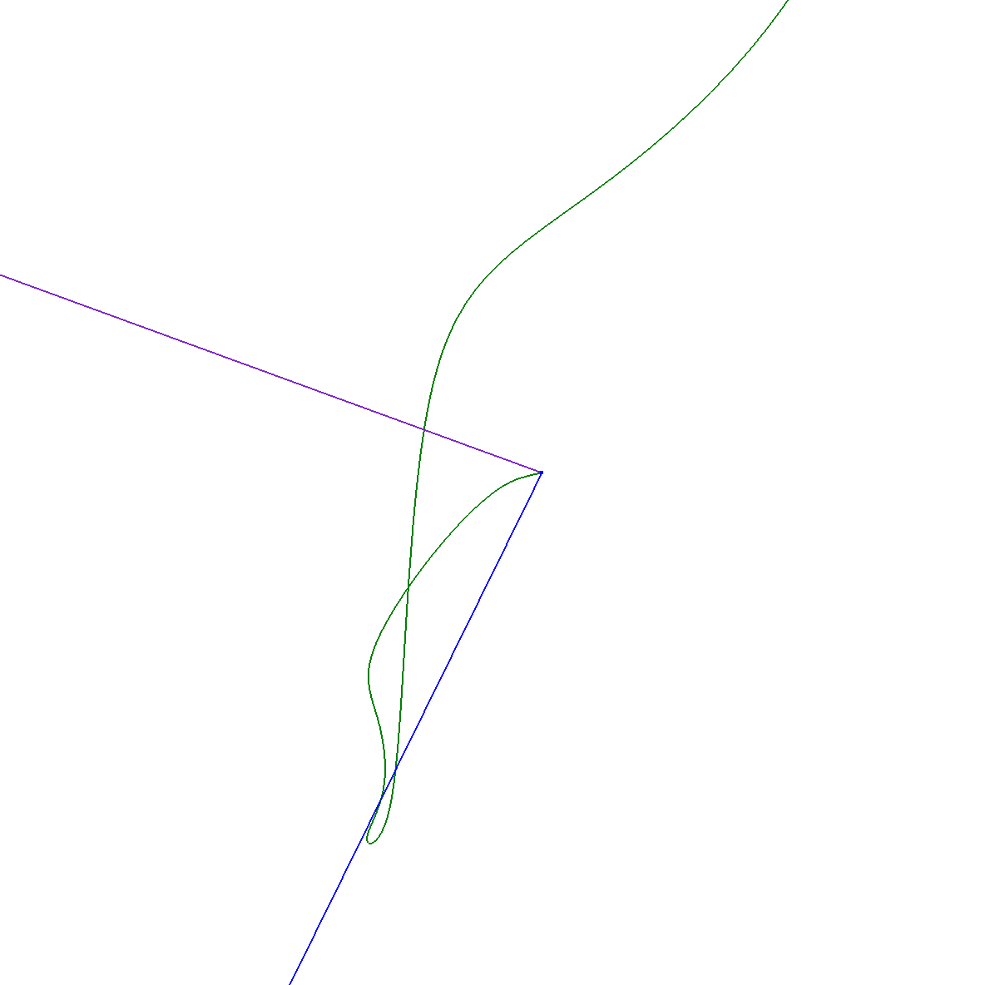

# Drift a part

## Abstract

#### _Visualization of a virtual path, generated by treating noise as information and integrating that over time._

## Inspiration

Exploration of the difference between the real and the virtual (assumed) positions of a thing due to noise in data assessment. This exploration was born from the desire to work with a part of data which we struggle a lot to get rid of: noise. During this constant struggle and maintenance, we do not necessarily realize how much noise we are removing. 

By leaving only noise and integrating the noise into speed, and then into distance (as would be done with real “valuable” data), we can visualize how much we would believe the part traveled without proper “information maintenance”. This concept not only relates to sensors, but also to how we can erroneously or distortedly assess informations about people, the world, relationships. As we cannot integrate the error or an assessment of a person over time, we are left to use sensors as metaphors.

## Main References

**Dead Reckoning**

>In navigation, dead reckoning is the process of calculating one's current position by using a previously determined position, and advancing that position based upon known or estimated speeds over elapsed time and course. Dead reckoning is subject to cumulative errors. 

(<a href="https://en.wikipedia.org/wiki/Dead_reckoning" target="_blank">Wikipedia</a>). 

**Reckoning**

>1. the action or process of calculating or estimating something.
>2. the avenging or punishing of past mistakes or misdeeds.

**Light Painting**

Painting with one or multiple long exposure photographies, overlapping and composing a single image using multiple cuts and slices of light in time and space.

**Architecture Photography**

The fact that the subject is still and you can use time to cheat when generating images. i.e.: taking photos of multiple configurations of lights/furnitures and redoing that in post production.

**Vertigo**

**Memento**

**Powers of Ten**

(<a href="https://www.youtube.com/watch?v=0fKBhvDjuy0" target="_blank">Youtube</a>). 

## Development Steps

### PYTHON (data modification):

Validation:
Can __random acceleration__ data generate interesting shapes?

	 - Script to generate mock data with predictable/calculatable results 
	 	(i.e.: 
	 		AccelX: 10m/sˆ2
	 		deltaTime = 1 second
	 		=> 
	 			deltaSpeedX of 10m/s (from AccelX * deltaTime)
	 			=>
	 				initSpeedX = 0 m/s
					finalSpeedX = initSpeedX + deltaSpeedX = 10m/s
					averageSpeedX = deltaSpeedX/2
					deltaDistanceX = deltaSpeedX * deltaTime = 5m)
	 - Script to integrate acceleration data into Speed and Speed into positions
	 	use previous mockData to test script, 
	 	should generate hand calculated data for multiple data points)
	 - Script to generate random mock data
	 - Generate positions and view on 3D Space from of CSV (Rhino and Web)

	 - Next issue: 
	 	Would it continue to be interesting with real data?

Validation:
Can **real noise from acceleration data** generate interesting shapes?

	 - Import real data (after Hardware/Firmware/Mechanical development)
	 - Export positions into 3D Space from CSV (into Rhino and Web visualizations)
	 - Heavy skew into Vertical Axis
	 	(I speculate that it is because its the axis that is suffering constant 1g
	 	and therefore drifting much more)
	 - Implementation of "High Pass" filter 
	 	(subtracting rolling average of current reading,
	 	previous implementation was just calculating local G from n readings during boot)

	 - Next issue: 
	 	It generates interesting shapes but unrecognizable in a linear scale.
	 	The overal shape is almost a straight line, and there are interesting
	 	movements zooming in 1000x and other different ones zooming in 1000000x.
	 	All cannot be seen at the same time.
		Is it possible to conciliate these different scales?

Validation:
Can **log-log graphs** make the interesting shapes in different scales all visible at the same time in 3D space?

	 - Implementation of log() conversion in Cartesian (XYZ) space.
	 	(log operation is done on each axis individually,
	 	this results in a heavy distortion of the shape, 
	 	it always crosses the quadrant planes perpendicularlly)
	 - Correction of log() implementation, now using Spherical (Radius, elevation, Azimuth) space.
	 	(log operation is done only on radius)
	
#### Python stable status:
	 - XYZ Acceleration noise data is imported into python
	 - XYZ Acceleration is integrated into XYZ speed
	 - XYZ Speed is integrated into XYZ positions
	 - XYZ positions are converted into Spherical coordinates
	 - Radius from spherical coordinates are changed into log scale
	 - Log Spherical positions are transformed into XYZ positions
	 - A CSV point cloud is exported

#### Python next steps:
	 - Automate the division of a large dataset into smaller CSVs, i.e.:
	 	Import 1 million data points and generate 100 Shapes with 10k points each.
	 - Bypass the SD card and receive the acceleration readings directly from MCU
	 - Output directly into GH instead of into a CSV. (or automate the importation of CSVs in GH)

	
  
  

	If this is roughly 1x scale 
	
	This would be roughly 1000x 
  
  This 1000000x 
  
  And this 1000000000x 
  
  Green is "linear", Blue is log conversion using cartesian coordinates, purple with spherical

### FIRMWARE

Teensy + MPU 9250 via Interrupt Driven SPI (an interval is configured during setup), so the IMU tells the MCU when to call for data.
Data is then logged into an SD card.

	 - Testing IMU via Interrupt driven SPI to Serial Port
	 - Testing IMU via Interrupt driven SPI to Serial Port and SD Card (which also uses SPI)
	 - Inclusion of OLED screen to show # of samples taken
	 - Inclusion of capacitive button to pause sample gathering
	 	In case the datalogger is about to be moved
	 - Testing dataset
	 - Implementing gravity "High Pass" filter
	 	A rolling average is subtracted from the current sample value.
	 	Previous implementation consisted of single calibration during boot.
	

#### Firmware next steps:
	 - Send data directly to a computer instead of to SD Card
	 - Maybe integrating the data and do log conversion on the MCU?
	 	MCU still has headroom, but its nice to have the raw data on the PC

  

### GRASSHOPPER + PRC (parametric robot control)

	 - Importing of point cloud data into SimplePath.GH example
	 - Modification of SimplePath example:
	 	CurveThroughPt on PointCloud
	 	Rotate the curve parametricaly
	 	Divide the curve into N parts
	 	Create a plane in the ends of the parts, oriented towards points we choose.
	 	Import custom geometry to use as tool
	 	Weave Kuka Robot Language Output manipualtion into Linear Movements 
	 		(trigger Lights and Camera after moving, wait for the photo to be taken and continue)

  

### PCB HOLDERS

3D printed supports for the datalogger

	 - Teensy + MPU
	 - Teensy + MPU + OLED + Capacitive button

  
  

STLs can be interactively viewed <a href="https://github.com/wes06/Drift-A-Part/blob/master/Mechanical%20Parts/PCB%20Supports/PCB%20Support%20-%20V1%20-%20RC.STL" target="_blank">here</a>.

### LED HOLDERS

3D printed + carbon fiber parts for the LED extension for the Kuka Robot

	 - STL with mock dimensions to test mesh import as tool into Grasshopper/PRC
	 	("extension" parallel to flange axis, thus wasting one axis :( )
	 - Holder with LED extension directly into X axis
	 	("extension" perpendicular to flange axis, turned out to be too agressive)
	 - Holder with LED extension 45 degress in relation to X and Z axis 
	 - Soldering of the LEDs, drilling a ping pong ball as diffuser, do some thermal testing:
	 	LEDs and current limiting resistors aren't large enough for 100% duty cycle, but enough for pulsing.

  
  

STLs can be interactively viewed <a href="https://render.githubusercontent.com/view/solid?url=https://raw.githubusercontent.com/wes06/Drift-A-Part/master/Mechanical%20Parts/Kuka%20Lights/LED%20Holder%20-%20Inclinado.STL" target="_blank">here</a>.

## Next Steps (as of 29th Jan 2018)
